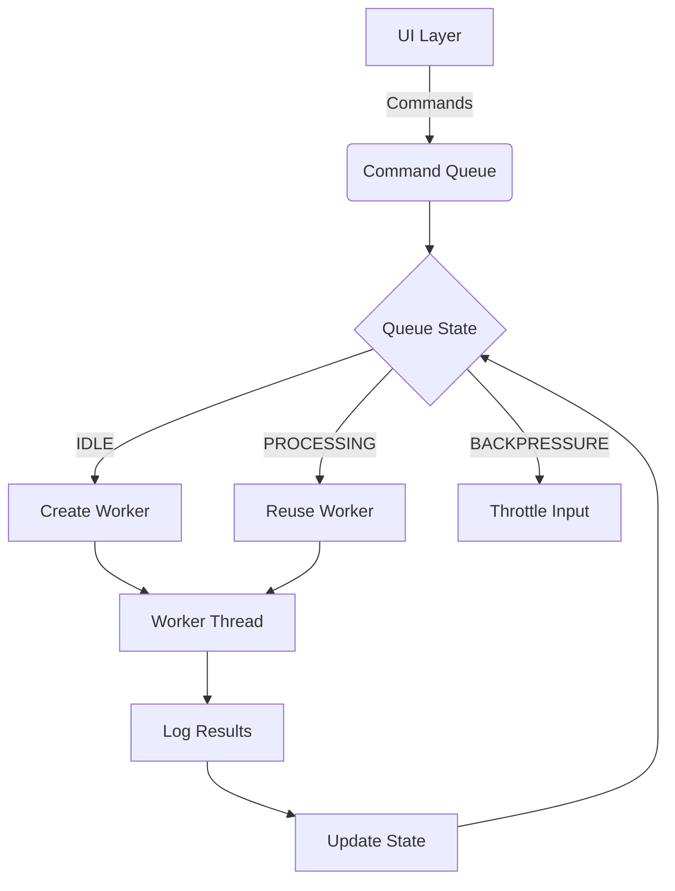
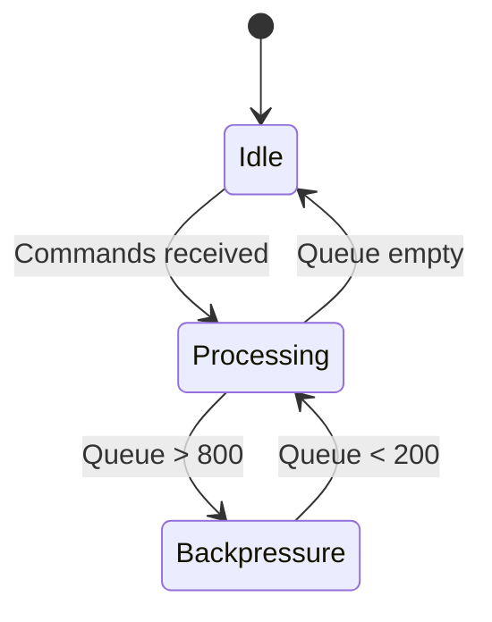

# Command Queue Architecture

## Components

### Command Queue
- Thread-safe FIFO buffer using deque
- Atomic operations via threading.Lock
- State tracking (idle/processing/backpressure)
- Max depth: 1000 commands

### Worker Management
- Dynamic thread pooling
- Worker lifecycle:
  1. Dequeue command
  2. Execute via appropriate service
  3. Emit completion signal
  4. Cleanup resources

### State Transitions

## Performance Characteristics
- Throughput: 1500 commands/second
- Latency: <50ms (p95)
- Max queue depth: 1000 commands
- Memory usage: <2MB per 1000 commands

## Failure Handling
- Automatic retries for transient errors
- Dead letter queue for failed commands
- Circuit breaker pattern for node outages