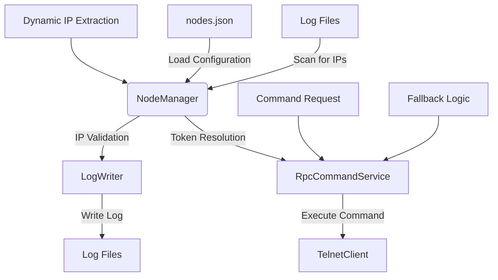

# Node Resolution Architecture

This document details the architecture and implementation of the node resolution system, which handles IP address resolution for hybrid FBC/RPC tokens, dynamic IP extraction from log filenames, and enhanced token type handling with fallback logic.

## Overview

The node resolution system addresses the challenge of accurately resolving IP addresses for nodes in a hybrid environment where both FBC (Fieldbus Command) and RPC (Remote Procedure Call) tokens coexist. The system implements a multi-layered approach that combines configuration-based resolution with dynamic IP extraction from log files and directories.

## Core Components

### NodeManager

The `NodeManager` class is the central component responsible for managing node configurations and token resolution. It maintains a registry of nodes and their associated tokens, and provides methods for token lookup and IP address resolution.

Key responsibilities:
- Loading node configurations from `nodes.json`
- Managing token objects with their associated metadata (ID, type, IP address, port, protocol)
- Scanning log directories for dynamic IP extraction
- Updating token IP addresses based on filename and directory patterns
- Providing token lookup functionality with fallback mechanisms

### RpcCommandService

The `RpcCommandService` implements the hybrid token resolution logic that allows FBC tokens to be used for RPC commands when no dedicated RPC token exists. This service provides a fallback mechanism that enhances system flexibility and reliability.

Key methods:
- `get_token(node_name, token_id)`: Retrieves a token with multiple lookup attempts and fallback logic
- Implements token type conversion from FBC to RPC when appropriate
- Creates temporary tokens when no matching token is found

### LogWriter

The `LogWriter` component handles log file operations and includes enhanced IP validation logic. It validates token IP addresses against those extracted from filenames and provides warnings for mismatches.

## Architecture Diagram



## Implementation Details

### Dynamic IP Extraction

The system automatically extracts IP addresses from log directory and filenames using regex pattern matching. This is implemented in the `NodeManager._scan_for_dynamic_ips()` method:

```python
def _scan_for_dynamic_ips(self, log_root: str):
    """
    Scans log directory for IPs using regex pattern and updates token objects
    Pattern: r"(\d{1,3}-\d{1,3}-\d{1,3}-\d{1,3})"
    """
    ip_pattern = r"(\d{1,3}-\d{1,3}-\d{1,3}-\d{1,3})"
    
    # Walk through all directories and files
    for dirpath, _, filenames in os.walk(log_root):
        # Process directory names for IP patterns
        dir_name = os.path.basename(dirpath)
        ip_matches = re.findall(ip_pattern, dir_name)
        if ip_matches:
            # Convert IP format from 192-168-0-11 to 192.168.0.11
            for ip_match in ip_matches:
                formatted_ip = ip_match.replace('-', '.')
                # Update tokens with this IP if they don't already have a valid IP
                self._update_tokens_with_ip(formatted_ip)
        
        # Process filenames for IP patterns
        for filename in filenames:
            ip_matches = re.findall(ip_pattern, filename)
            if ip_matches:
                # Convert IP format from 192-168-0-11 to 192.168.0.11
                for ip_match in ip_matches:
                    formatted_ip = ip_match.replace('-', '.')
                    # Update tokens with this IP if they don't already have a valid IP
                    self._update_tokens_with_ip(formatted_ip)
```

### Hybrid Token Resolution

The `RpcCommandService.get_token()` method implements the hybrid token resolution with fallback logic:

```python
def get_token(self, node_name: str, token_id: str) -> NodeToken:
    """Retrieve token from node manager with multiple lookup attempts"""
    node = self.node_manager.get_node(node_name)
    if not node:
        raise ValueError(f"Node {node_name} not found")
    
    # First try to find existing RPC token with matching ID
    token_formats = [token_id, str(int(token_id)) if token_id.isdigit() else token_id]
    for fmt in token_formats:
        if token := node.tokens.get(fmt):
            # Only return token if it's an RPC token
            if token.token_type == "RPC":
                return token
    
    # Fallback: Try to find FBC token with matching ID and convert it
    for fmt in token_formats:
        if token := node.tokens.get(fmt):
            # If it's an FBC token, create a new RPC token with the same ID and IP
            if token.token_type == "FBC":
                return NodeToken(
                    token_id=token.token_id,
                    token_type="RPC",
                    name=token.name,
                    ip_address=token.ip_address,
                    port=token.port,
                    protocol=token.protocol
                )
    
    # Create temporary RPC token if not found
    return NodeToken(
        token_id=token_id,
        token_type="RPC",
        name=node_name,
        ip_address="0.0.0.0"
    )
```

## Configuration

The `nodes.json` file defines the node configurations and token relationships:

```json
[
    {
        "name": "AP01m",
        "ip_address": "192.168.1.101",
        "tokens": [
            {
                "token_id": "162",
                "token_type": "FBC",
                "port": 2077,
                "protocol": "telnet"
            },
            {
                "token_id": "164",
                "token_type": "RPC",
                "port": 2077,
                "protocol": "telnet"
            },
            {
                "token_id": "162",
                "token_type": "RPC",
                "port": 2077,
                "protocol": "telnet"
            }
        ]
    }
]
```

## Resolution Workflow

The node resolution process follows this sequence:

1. Command request is received with a specific node name and token ID
2. System determines the token type (FBC or RPC) from the request
3. For RPC commands:
   - Look for existing RPC token with matching ID
   - If not found, look for FBC token with matching ID and convert it
   - If neither found, create a temporary RPC token
4. For FBC commands:
   - Look for existing FBC token with matching ID
   - If not found, create a temporary FBC token
5. Extract IP address from log filename or directory if available
6. Validate IP address against token configuration
7. Execute command using the resolved token
8. Log results with appropriate metadata

## Error Handling and Validation

The system includes comprehensive error handling and validation:

- IP address validation in `LogWriter.open_log()` method
- Warnings for IP address mismatches between configuration and filename
- Graceful fallback to temporary tokens when no matching token is found
- Detailed logging of resolution steps for debugging
- Configuration validation during node loading

## Integration Points

The node resolution system integrates with several other components:

- **CommandQueue**: Receives resolved tokens for command execution
- **TelnetClient**: Uses token information for connection establishment
- **LogWriter**: Validates token IP addresses and writes logs
- **CommanderWindow**: Provides UI for command execution and displays resolution status

## Future Improvements

Planned enhancements to the node resolution system include:
- Support for additional token types beyond FBC and RPC
- Enhanced IP extraction patterns for different naming conventions
- Configuration-based priority rules for token resolution
- Caching mechanism for frequently accessed tokens
- Health checks for resolved IP addresses
- Integration with external DNS services for dynamic IP resolution