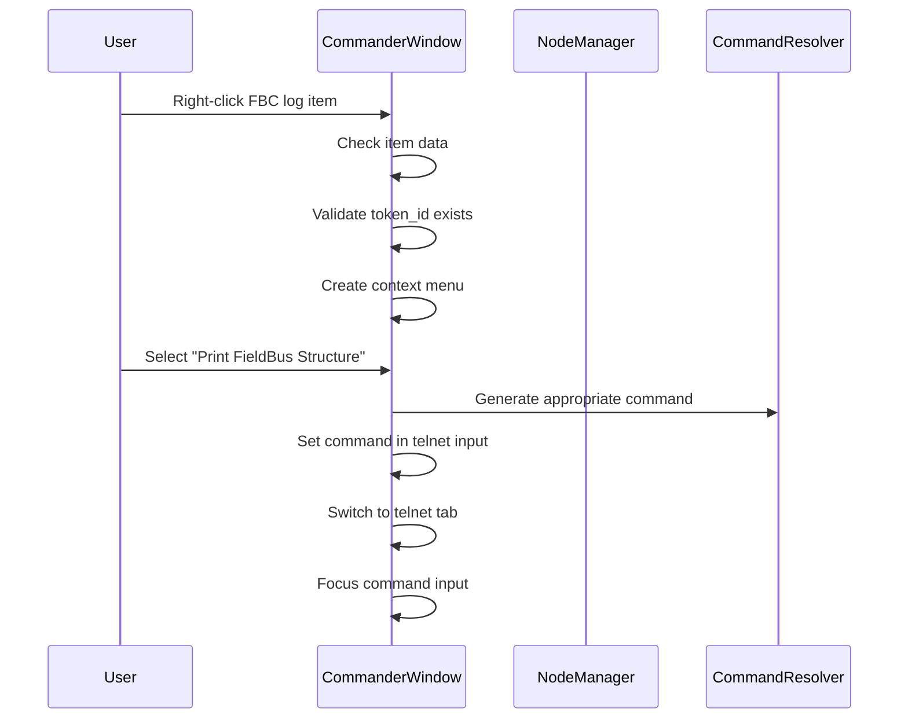

# Commander Application Sequence Flow

## User Interface Initialization
1. CommanderWindow class initializes UI components
2. Sets up dual-pane layout (node tree and session tabs)
3. Configures node tree with context menu capability
4. Loads node configuration if available
5. Populates node tree with scanned log files

## Context Menu Execution Flow

## Key Interactions
- **CTX_MENU**: FieldBus command generation
- **STATUS_FEEDBACK**: Status bar messages
- **CMD_EXEC**: Telnet command execution
- **LOG_COPY**: Session content log saving