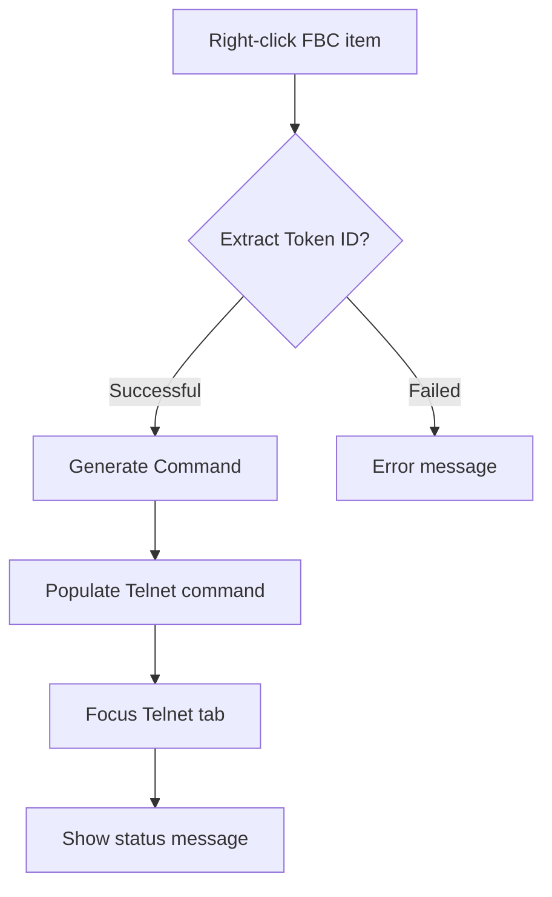

# GUI Design Specification - Commander Window

## Overview
The Commander Window provides a dual-pane interface for managing nodes and executing remote commands. The left pane displays available nodes and their logs, while the right pane hosts session tabs for Telnet, VNC, and FTP operations.

## Layout
- **Left Pane (Nodes)**: 30% width, node hierarchy
- **Right Pane (Sessions)**: 70% width, tabbed interface
- **Bottom Toolbar**: Action buttons
- **Status Bar**: System messages

## Node Tree Features
- Hierarchical display of nodes and log types (FBC, RPC, LOG, LIS)
- **Icons**: Online/offline status indicators
- **Double-click**: Opens log file in system viewer
- **Click**: Selects node for operations
- **Right-click context menu**:
  - FBC items: "Print FieldBus Structure" option
  - Executes token-specific command in Telnet tab

## Session Tabs
1. **Telnet Tab**: 
   - Command execution interface
   - Real-time output display
   - Connection management

2. **VNC Tab**:
   - VNC session display
   - Connection management

3. **FTP Tab**:
   - FTP session interface
   - Connection management

## Context Menu Workflow

## Action Buttons
- **Execute**: Run Telnet command
- **Copy to Node Log**: Save session output
- **Stop Session**: Terminate active session
- **Save Session**: Save session state

## Theme
Dark theme with grey/neutral accents for eye comfort during prolonged use.