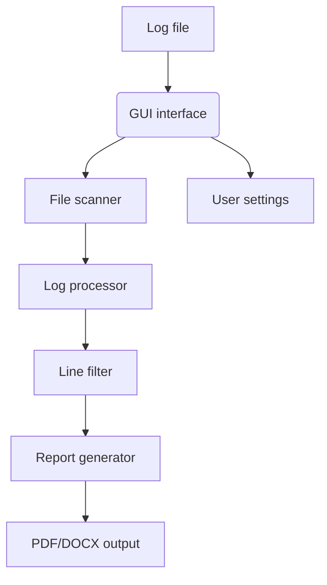

---
### 2. System Architecture 
**Path:** `_BMPRSS/_BLUEPRINT/SYSTEM_ARCHITECTURE.md`
```markdown
# LOGReport system architecture v2.1

## Updated component diagram

```mermaid
flowchart TD
    A[Log file] --> B(GUI interface)
    B --> C[File scanner]
    C --> D[Log processor]
    D --> E[Line filter]
    E --> F[Report generator]
    F --> G[PDF/DOCX output]
    B --> H[User settings]
```