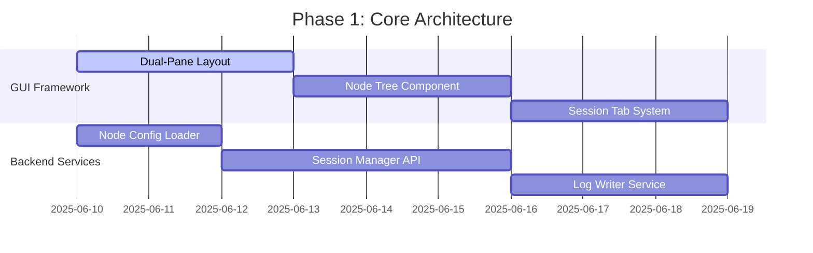
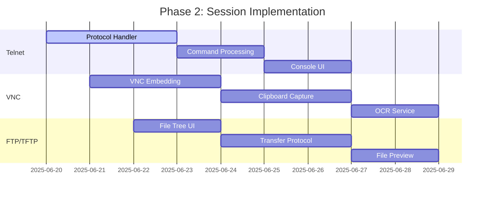
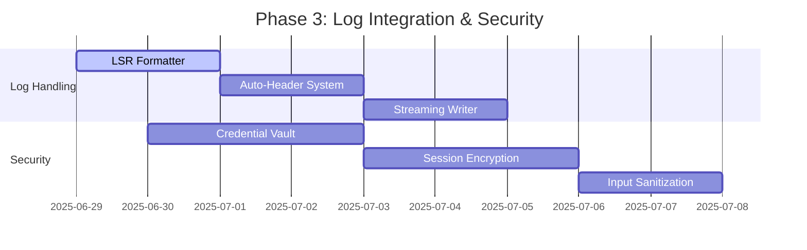
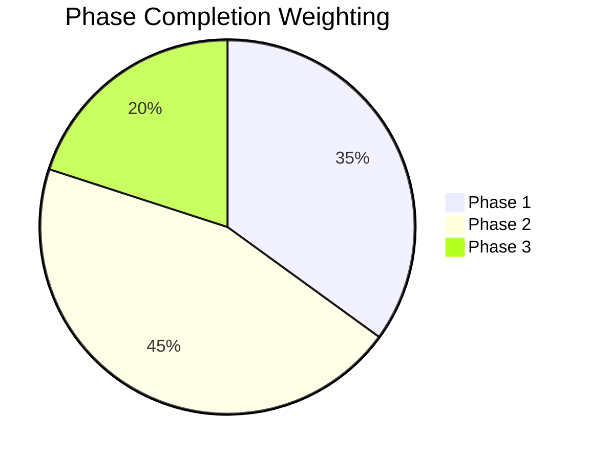

# Commander Module Development Roadmap

**Version:** 1.0  
**Created:** 2025-06-08  
**Timeline:** 2025-06-10 to 2025-07-05  

## Phase 1: Core Architecture Implementation (2025-06-10 to 2025-06-19)


### 👥 Task Breakdown: Core Architecture

1. **Interface Framework**
   - [ ] Implement dual-pane resizable layout (30/70 split)
   - [ ] Create collapsible node tree widget
   - [ ] Design session tab container with persistent state

2. **Node Management System**
   - [ ] Parse and validate nodes.json configuration
   - [ ] Render node hierarchy with status indicators
   - [ ] Implement context-sensitive token display
   - [ ] Create node CRUD operations UI

3. **Session Management**
   - [ ] Session registry service
   - [ ] Protocol connection routing
   - [ ] Core event bus system

## Phase 2: Session Implementation (2025-06-20 to 2025-06-28)


### 🖥️ Task Breakdown: Session Implementation

1. **Telnet Module**
   - [ ] Telnet client with TLS support
   - [ ] Command parser with token substitution
   - [ ] ANSI color rendering console
   - [ ] Command history management

2. **VNC Module**
   - [ ] Embedded VNC viewer component
   - [ ] Clipboard synchronization
   - [ ] Screenshot capture to clipboard
   - [ ] OCR text extraction service

3. **FTP/TFTP Module**
   - [ ] Remote file tree explorer
   - [ ] Secure file transfer handlers
   - [ ] Text file preview component
   - [ ] Content comparison tools

## Phase 3: Log Integration & Security (2025-06-29 to 2025-07-05)


### 🔐 Task Breakdown: Log & Security

1. **Log Integration**
   - [ ] LSR-compliant formatter service
   - [ ] Log writing API for all protocols
   - [ ] Log rotation manager
   - [ ] Progress tracking indicators

2. **Security Implementation**
   - [ ] AES-256 credential storage
   - [ ] TLS 1.3 for Telnet/FTP
   - [ ] SSH tunneling for VNC
   - [ ] Command input sanitization
   - [ ] Session token rotation

## Milestones & Deliverables


### 🎯 Acceptance Criteria
1. **MVP Release (2025-06-24):**
   - Working Telnet session with logging
   - Basic node tree implementation
   - Core command processing
   
2. **Feature Complete (2025-07-03):**
   - All three session types functional
   - Log writing to all destinations
   - Security implementation
   
3. **RC Release (2025-07-05):**
   - Full test coverage
   - Performance benchmarks met
   - Documentation complete

## Dependency Management
| Component          | Dependencies                     | Resolution Plan              |
|--------------------|----------------------------------|------------------------------|
| VNC OCR Processing | Tesseract 5.2+                   | Include in package installer |
| TLS Implementation | PyOpenSSL 3.0+                   | Add to requirements          |
| FTP Client         | ftplib (stdlib)                  | Use standard library         |
| GUI Framework      | PyQt6 6.5+                       | Pin in requirements          |

## Risk Management
1. **Protocol Compatibility**: Will implement adapter pattern for VNC
2. **Performance Concerns**: Added code profiling points
3. **OCR Accuracy**: Added fallback to manual selection
4. **Security Validation**: Penetration testing scheduled

## Measurement Plan
1. **Quality Metrics**:
   - Test coverage ≥ 85%
   - Lint score: 9.5/10
   - Static analysis: zero critical issues
   
2. **Performance Metrics**:
   - Telnet response: < 200ms
   - VNC capture: < 800ms
   - FTP transfer: < 1MB/s

3. **Adoption Tracking**:
   - Session success rate
   - Log retention compliance
   - Connection error ratios
```