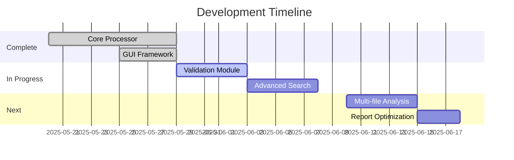

# PROJECT_CONTEXT.md Template

**Last Updated:** 2025-05-29
**Project Phase:** Implementation & Testing

## 1. Project Overview

**System Purpose:** LOGReport is a log processing and report generation system that analyzes log files and transforms them into structured reports in PDF/DOCX formats with consistent styling.

**Key Features:**
- Directory scanning for log files
- Configurable line filtering (first/last N lines or range)
- Folder-based chapter nesting in reports
- Multiple encoding support (utf-8, ascii, latin-1)
- Progress tracking GUI

## 2. Basic Principles

> **Guiding principles for development:**

### Mandatory Standards
1. **Modular Processing Pipeline**:
   - Strict separation between collection, processing and generation
   - Each component must implement validate() and execute() methods

2. **File Handling Requirements**:
   ```python
   # As defined in FILE_PROCESSING.md
   MAX_FILE_SIZE = 10_000_000  # 10MB (Not yet enforced)
   # Note: .text support inconsistent (implemented in single-file 
   # processing but not directory scans)
   SUPPORTED_EXTENSIONS = ('.log','.txt')
   ```

## 3. Project Structure

```
graph LR
    A[File Scanner] --> B[Log Processor]
    B --> C[PDF Generator]
    B --> D[DOCX Generator]
    C --> E[(Reports)]
    D --> E
```

## 4. Current Focus & Status

**Current Focus:** 
- Adding validation logic (size/extension checks)
- Implementing advanced search features
- Finalizing PDF/DOCX styling implementation

**Status:** 
- Core processing pipeline implemented
- Line filtering and folder-based nesting operational
- Encoding fallback mechanism working
- GUI interface for progress tracking functional

# LOGReport Project Context v3.2

## Current State
**Implemented Features**:
✅ Line filtering system  
✅ Folder-based chapter nesting  
✅ Progress tracking GUI  
✅ Encoding fallback support  
✅ PDF/DOCX style consistency (whitespace preservation)  
☑️ File validation (not implemented)  

## Roadmap Adjustments


## 5. Development Guidelines

1. **Coding Standards**:
   - Follow PEP8 except line length (max 120 chars)
   - Type hints for all function signatures
   - Docstrings for public methods

2. **File Processing**:
   - Validate parameters before processing
   - Handle encoding issues gracefully
   - Enforce size limits

3. **Testing Procedures**:
   - Unit tests for processor components
   - Integration tests for full pipeline
   - GUI interaction tests

## 6. Getting Started

**Requirements:**
- Python 3.9+
- ReportLab (for PDF generation)
- python-docx (for DOCX generation)
- PyQt6 (for GUI)

**Setup:**
```shell
pip install -r requirements.txt
python src/main.py
```