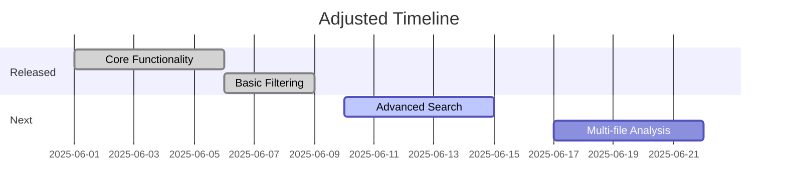

# PROJECT_CONTEXT.md Template

**Last Updated:** 2025-05-31  
**Project Phase:** Design Finalization

## 1. Project Overview

**System Purpose:** LOGReport is a [brief description of what your project does]

**Key Features:**
- Feature 1
- Feature 2
- Feature 3

## 2. Basic Principles

> **Guiding principles for development:**

### Mandatory Standards
1. **Modular Processing Pipeline**:
   - Strict separation between collection, processing and generation
   - Each component must implement validate() and execute() methods

2. **File Handling Requirements**:
   ```python
   # As defined in FILE_PROCESSING.md
   MAX_FILE_SIZE = 10_000_000  # 10MB
   SUPPORTED_EXTENSIONS = ('.log','.txt','.text')
   ```

## 3. Project Structure

```
graph LR
    A[File Scanner] --> B[Log Processor]
    B --> C[PDF Generator]
    B --> D[DOCX Generator]
    C --> E[(Reports)]
    D --> E
```

## 4. Current Focus & Status

**Current Focus:** [Current development focus]
**Status:** [Completion status and key milestones]

# LOGReport Project Context v3.0

## Current State
**Implemented Features**:
✅ Line filtering system  
✅ Folder-based chapter nesting  
✅ PDF/DOCX style consistency  
✅ Progress tracking GUI

## Roadmap Adjustments


## 5. Development Guidelines

1. Coding standards
2. Documentation requirements
3. Testing procedures

## 6. Getting Started

**Requirements:**
- Requirement 1
- Requirement 2

**Setup:**
1. Step 1
2. Step 2