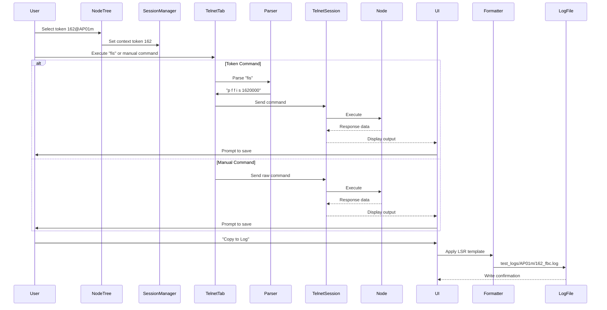

# Commander GUI Blueprint v2.1

**Last Updated:** 2025-06-08  
**Updates:** Enhanced command processing, session management, log writing

## Functional Overview
The Commander GUI provides centralized management of DNA system nodes through:
1. **Unified Session Management**: Tabbed Telnet/VNC/FTP interfaces
2. **Context-Aware Commands**: Token-based command substitution
3. **Cross-Session Log Writing**: Copy any content to node logs
4. **Connection Automation**: IP assignment based on node configuration
5. **Manual Input System**: Full control over command execution

## Enhanced Command Flow


## Session Management Architecture

### Protocol Handlers
```python
class TelnetHandler:
    def send_command(self, command: str):
        # Send command and stream response
        pass

    def format_response(self, output: str) -> str:
        # Apply ANSI formatting and timestamps
        pass

class VNCViewer:
    def capture_screenshot(self) -> Image:
        # Capture active region or full screen
        pass
    
    def copy_to_clipboard(self, text: str):
        # Transfer text to system clipboard
        pass

class FTPClient:
    def copy_to_log(self, remote_path, log_path):
        # Download and append to log
        pass
```

### Log Writer Service
```python
class LogWriter:
    def __init__(self):
        self.handles = {}  # token: file handle
    
    def open_log(self, token_path: str):
        if token_path not in self.handles:
            self.handles[token_path] = open(token_path, 'a', encoding='utf-8')
    
    def append_to_log(self, token_path: str, content: str):
        self.open_log(token_path)
        self.handles[token_path].write(f"\n{content}\n")
        self.handles[token_path].flush()
    
    def close_log(self, token_path: str):
        if token_path in self.handles:
            self.handles[token_path].close()
            del self.handles[token_path]
```

## Connection Bar Implementation
```python
class ConnectionBar(QWidget):
    def __init__(self, ip_address: str, port: int):
        super().__init__()
        self.layout = QHBoxLayout()
        self.address_label = QLabel(f"{ip_address}:{port}")
        self.status_icon = QLabel("◌")
        self.connect_btn = QPushButton("Connect")
        self.layout.addWidget(self.address_label)
        self.layout.addWidget(self.status_icon)
        self.layout.addWidget(self.connect_btn)
        self.setLayout(self.layout)
    
    def update_status(self, state: ConnectionState):
        icons = {
            ConnectionState.DISCONNECTED: "○",
            ConnectionState.CONNECTING: "◑",
            ConnectionState.CONNECTED: "●",
            ConnectionState.ERROR: "⨯"
        }
        self.status_icon.setText(icons[state])
```
    User->>Commander: Select node, token, and log type
    alt Telnet Command
        Commander->>DNA_Debugger: Send formatted command
        DNA_Debugger->>Node: Route via token
        Node->>DNA_Debugger: Return log data
        DNA_Debugger->>Commander: Forward output
    else VNC Command
        Commander->>VNC_Viewer: Direct connection
        VNC_Viewer->>Node: Send keyboard sequence
        Node->>VNC_Viewer: Return visual output
        VNC_Viewer->>OCR: Extract text from screenshot
    end
    Commander->>LogFormatter: Apply LSR standards
    LogFormatter->>Filesystem: Save to test_logs/&lt;node>/&lt;token>_&lt;type>.log
```

## Log Retrieval Command Schema
```json
{
  "log_types": {
    "FBC": {
      "command": "print_fieldbus ${token}0000",
      "description": "Retrieve fieldbus I/O structure data"
    },
    "RPC": {
      "command": "print_rpc_logs ${token}",
      "description": "Get RPC command history"
    },
    "LOG": {
      "command": "get_system_logs ${token}",
      "description": "Retrieve system-level logs"
    }
  },
  "vnc_sequences": {
    "FBC_162": ["Ctrl+Alt+F1"],
    "FBC_163": ["Ctrl+Alt+F2"],
    "RPC_360": ["Ctrl+Alt+R"],
    "LOG_ALL": ["Ctrl+Alt+L"]
  }
}
```

## Session Management
1. **DNA Debugger Connection**:
   - Host/IP: debug-host.vendor.com
   - Port: 2077 (fixed for system)
   - Protocol: Telnet with TLS encryption
   - Credential management: Central credential service

2. **VNC Node Connections**:
   - Per-node host/IP configuration 
   - Port assignment: 5900 + token suffix
   - Independent credential sets
   - SSL encryption

## Core Components
1. **Connection Manager**: Maintains active sessions
2. **Command Resolver**: Translates token/type to commands
3. **Output Processor**: Formats responses per LSR standard
4. **Log Archiver**: Rotates and compresses old logs

