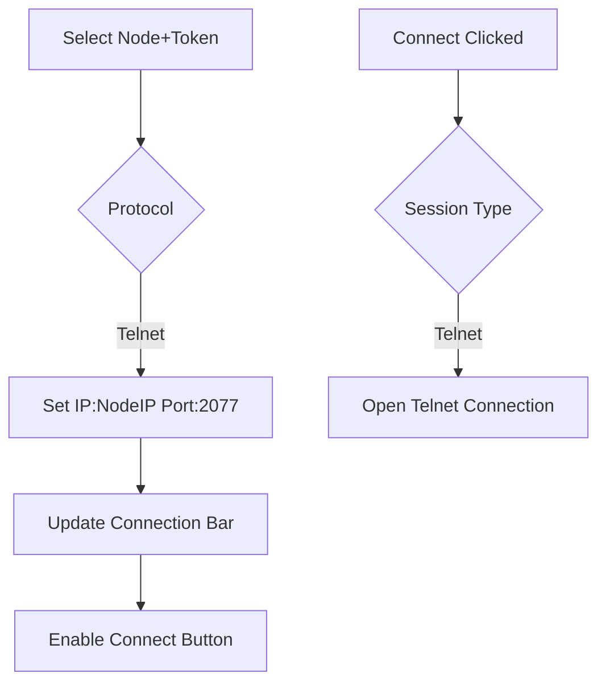
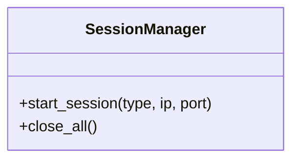

# Commander GUI Specification v2.1

**Last Updated:** 2025-06-08  
**Key Changes:** Added session tabs, enhanced node tree, connection management

## 1. Dual-Pane Interface
```plaintext
┌───────────────────────────────┬───────────────────────────────┐
│       NODE MANAGEMENT PANE    │     SESSION OPERATIONS        │
│         (Fixed 30% width)     │        (70% width)            │
├───────────────────────────────┼───────────────────────────────┤
│ ● Node Tree:                  │ ┌──TABS─────────────────────┐ │
│   ▼ AP01m (192.168.1.101 ●)   │ │  Telnet                   │ │
│     ├─162 [FBC]               │ ├───────────────────────────┤ │
│     │   Log: test_logs/AP01m/162_fbc.log │ [Session Content]  │
│     └─163 [VNC]               │ │                           │ │
│         Log: ...163_vnc.log   │ └───────────────┐           │ │
│                               │ ┌──CONNECT BAR──┤           │ │
│ ● Commands:                   │ │ [IP:Port] [●] [Connect]   │ │
│   - p s (Print System)        │ └───────────────┘           │ │
│   - fis (Fieldbus I/O Struct) │                               │
│   - rc (RUPI Counters)        │ [Copy to Log Button]          │
│                               │ [Save Log Session]            │
│ [Add Node] [Edit] [Refresh]   │                               │
└───────────────────────────────┴───────────────────────────────┘
```

## 2. Node Tree Specification

**Node Properties:**
```markdown
- **Name Prefix**: AP/AL prefix validation
- **IP Address**: IPv4 format enforcement
- **Status Indicators**:
  - ● Green: Active session
  - ○ Gray: Offline
  - ⚠ Yellow: Connection issues

- **Token-Level Details**:
  - ID: 3-5 digit token code
  - Type: FBC/RPC/LOG/LIS
  - Protocol: Telnet/VNC/FTP
  - Log Path: `test_logs/<node>/<token>_<type>.log`
  - Handle Status: [Open/Closed]
```

## 3. Session Tabs

### Telnet Tab Features:
```markdown
- **Manual Input**: Raw command editor
- **Output Console**: Plain text display
- **Bottom Connection Bar**:
   - IP:Port display with connection status
   - Connect/Disconnect buttons
```

## 4. Connection Management System


## 5. Content Transfer Protocols

**Telnet Output Transfer:**
```python
def transfer_telnet_output(output, log_path):
    with open(log_path, 'a', encoding='utf-8') as log:
        header = f"// TELNET CAPTURE {datetime.now()}"
        log.write(f"{header}\n{'-'*40}\n")
        log.write(output)
```

## 6. Security Implementation


**Protocol Security:**
- Telnet: Unencrypted (no encryption implemented)
- Credential storage: Not implemented

## 7. Performance Targets
| Operation                | Max Latency |
|--------------------------|-------------|
| Telnet Command Execution | ≤ 200ms     |
| Log Write (1MB)          | ≤ 50ms      |
| GUI Refresh Rate         | 60 FPS      |

## 8. Best Practices
1. **Connection Management**:
   - Auto-reconnect with exponential backoff
   - Session state persistence
   - Connection pooling for high-frequency commands
    
2. **Log Handling**:
   - Atomic file writes
   - Buffer management
   - File rotation at 100MB

3. **Cross-Platform Support**:
   - Windows, macOS, and Linux compatibility
   - Accessibility features
   - High DPI support