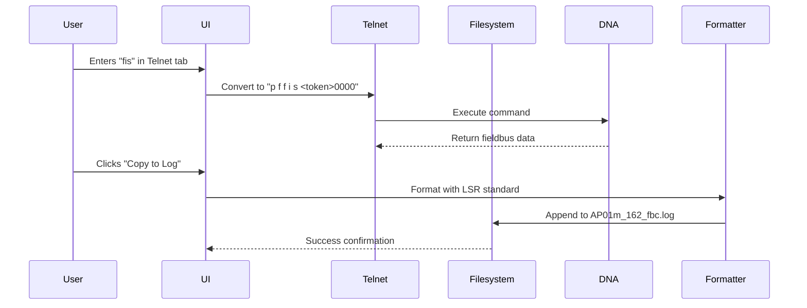
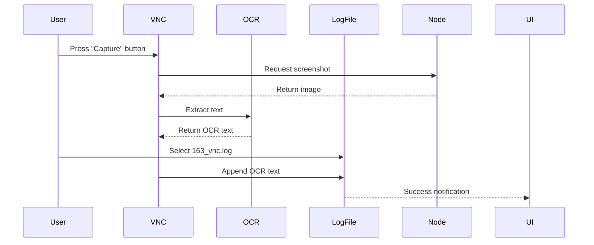
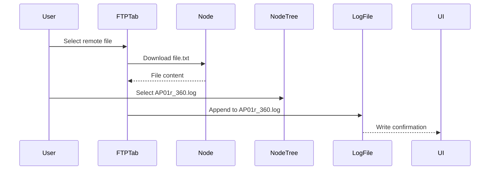
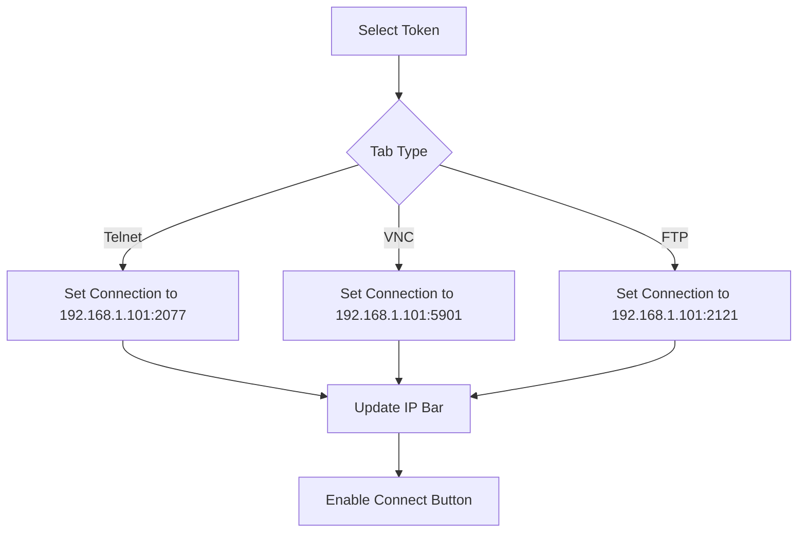

# Commander Sequence Diagrams v2.1

**Last Updated:** 2025-06-08  
**New Sequences:** Added manual command flow and content transfer

## Manual Command Execution Flow


## VNC Content Transfer Sequence


## FTP Log Integration Sequence


## Connection Management Flow

    
    User-&gt;&gt;UI: Select Node, Token, Type (FBC)
    UI-&gt;&gt;CommandResolver: Request command for 162, FBC
    CommandResolver-&gt;&gt;UI: Return "print_fieldbus 1620000"
    UI-&gt;&gt;DNA_Debugger: Send command
    DNA_Debugger-&gt;&gt;Node: Route to proper subsystem
    Node-&gt;&gt;DNA_Debugger: Fieldbus I/O data (162)
    DNA_Debugger-&gt;&gt;UI: Return response
    UI-&gt;&gt;Formatter: Apply LSR formatting
    Formatter-&gt;&gt;Filesystem: test_logs/AP01m/162_fbc.log
    Filesystem-&gt;&gt;UI: Save confirmation
```

## VNC Log Retrieval Sequence
```mermaid
sequenceDiagram
    participant User
    participant UI
    participant VNC_Manager
    participant Node_VNC
    participant OCR_Engine
    participant Formatter
    
    User-&gt;&gt;UI: Select VNC mode for AP01r:362
    UI-&gt;&gt;VNC_Manager: Request connection
    VNC_Manager-&gt;&gt;Node_VNC: Authenticate (port:5902)
    Node_VNC-&gt;&gt;VNC_Manager: Session established
    UI-&gt;&gt;VNC_Manager: Send FBC_362 sequence
    VNC_Manager-&gt;&gt;Node_VNC: Ctrl+Alt+F3
    Node_VNC-&gt;&gt;VNC_Manager: Screen update
    VNC_Manager-&gt;&gt;OCR_Engine: Extract text from screenshot
    OCR_Engine-&gt;&gt;UI: Recognized log text
    UI-&gt;&gt;Formatter: Apply LSR standards
    Formatter-&gt;&gt;Filesystem: test_logs/AP01r/362_fbc.log
```

## Error Recovery Sequence
```mermaid
sequenceDiagram
    participant UI
    participant DNA_Debugger
    participant ErrorHandler
    
    UI-&gt;&gt;DNA_Debugger: Send command
    DNA_Debugger-x UI: Timeout after 30s
    UI-&gt;&gt;ErrorHandler: Report failure
    ErrorHandler-&gt;&gt;UI: Initiate retry procedure
    UI-&gt;&gt;DNA_Debugger: Retry command
    DNA_Debugger--&gt;&gt;UI: Success!
    UI-&gt;&gt;Filesystem: Save log normally
```

## Security Protocol Flow
```mermaid
sequenceDiagram
    participant UI
    participant CredentialStore
    participant DNA_Debugger
    participant VNC_Node
    
    UI-&gt;&gt;CredentialStore: Request debugger credentials
    CredentialStore-&gt;&gt;UI: Encrypted credentials
    UI-&gt;&gt;DNA_Debugger: Connect with decrypted creds
    DNA_Debugger-&gt;&gt;UI: Session token
    
    UI-&gt;&gt;CredentialStore: Request VNC credentials
    CredentialStore-&gt;&gt;UI: Encrypted node credentials
    UI-&gt;&gt;VNC_Node: Establish SSL connection
    VNC_Node-&gt;&gt;UI: VNC session ID
```
