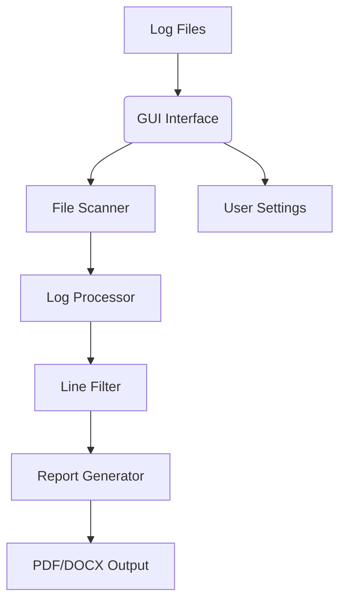

---

### 2. System Architecture 
**Path:** `_BMPRSS/_BLUEPRINT/SYSTEM_ARCHITECTURE.md`
```markdown
# LOGReport System Architecture v2.1

## Updated Component Diagram

```mermaid
flowchart TD
    A[Log Files] --> B(GUI Interface)
    B --> C[File Scanner]
    C --> D[Log Processor]
    D --> E[Line Filter]
    E --> F[Report Generator]
    F --> G[PDF/DOCX Output]
    B --> H[User Settings]
```