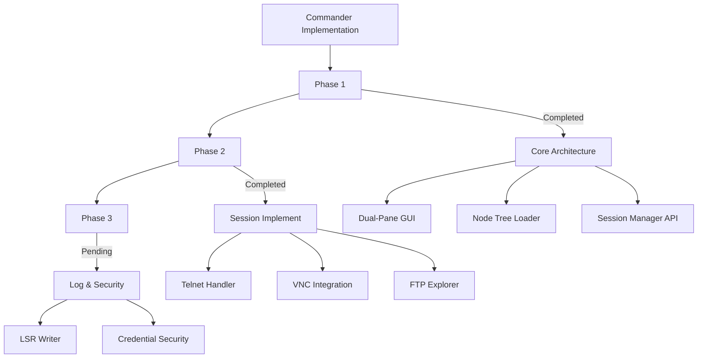
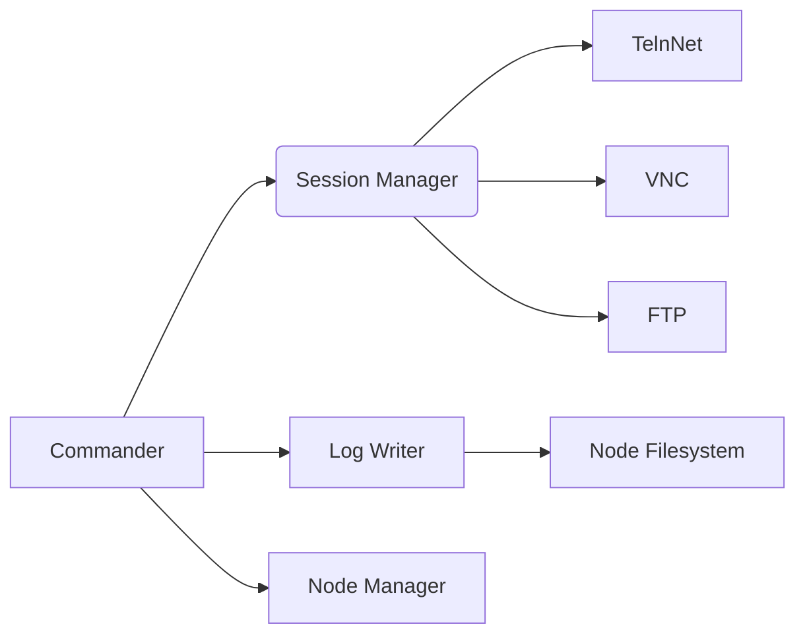
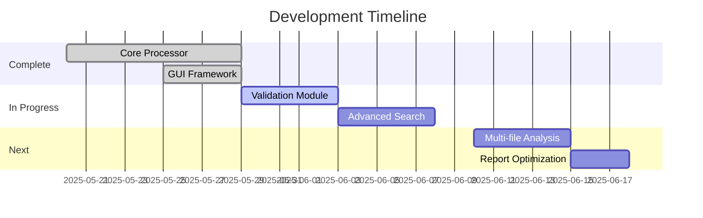

# LOGReport Project Context v3.5

**Last Updated:** 2025-06-08  
**Project Phase:** Commander Module Implementation  

## 1. System Overview

**Core Purpose:** Automated log processing and reporting system with central Commander interface for log generation and management.

**Expanded Feature Set:**
- Tab-based session management (Telnet, VNC, FTP)
- Node-tree log file organization 
- Multi-protocol content acquisition
- LSR-compliant log formatting
- Token-based command execution

## 2. Commander Module Status


**Phase 1 Completion: 100%**
- ✅ Dual-pane UI framework
- ✅ Node config loader implementation
- ✅ Session manager API prototype
- ✅ Log writer service

## 3. Revised Development Guidelines

1. **Commander-Specific Standards:**
   - Type-hinted Python code throughout
   - Session logging for all operations
   - LSR headers on all generated logs
   - Connection bar on every session tab

2. **Performance Requirements:**
   ```python
   # Commander Performance Targets
   CMD_HANDLE_LATENCY = 0.2    # Seconds max
   GUI_RESPONSIVENESS = 100    # ms max operation delay
   LOG_WRITE_TIME = 0.05       # Seconds per MB
   ```

3. **Security Protocols:**
   - Staged credential implementation:
      Phase 1: Cleartext (local dev)
      Phase 2: Encrypted credentials
      Phase 3: Certificate-based auth

## 4. Roadmap Integration
```gantt
gantt
    title Commander Module Timeline
    dateFormat  YYYY-MM-DD
    
    section Phase 1
    GUI Framework       :done, 2025-06-10, 3d
    Node Manager        :done, 2025-06-13, 3d
    Session Backend     :done, 2025-06-16, 3d
    
    section Phase 2
    Telnet UI           :2025-06-20, 3d
    VNC Integration     :2025-06-23, 4d
    FTP Explorer        :2025-06-27, 3d
    
    section Phase 3
    Log Formatter       :2025-06-30, 3d
    Security Layer      :2025-07-03, 4d
```

## 5. Updated Build Instructions
```bash
# New requirements
pip install pyqt6 telnetlib3 pillow

# Test Commander components
python src/commander/session_manager.py
python src/commander/log_writer.py
```

## 6. Key Architectural Changes


> **Implementation Philosophy:** "Log First" approach - All commander operations should write or append to structured log files immediately.
```

### Mandatory Standards
1. **Modular Processing Pipeline**:
   - Strict separation between collection, processing and generation
   - Each component must implement validate() and execute() methods

2. **File Handling Requirements**:
   ```python
   # As defined in FILE_PROCESSING.md
   MAX_FILE_SIZE = 10_000_000  # 10MB (Not yet enforced)
   # Note: .text support inconsistent (implemented in single-file 
   # processing but not directory scans)
   SUPPORTED_EXTENSIONS = ('.log','.txt')
   ```

## 3. Project Structure

```
graph LR
    A[File Scanner] --> B[Log Processor]
    B --> C[PDF Generator]
    B --> D[DOCX Generator]
    C --> E[(Reports)]
    D --> E
```

## 4. Current Focus & Status

**Current Focus:** 
- Adding validation logic (size/extension checks)
- Implementing advanced search features
- Finalizing PDF/DOCX styling implementation

**Status:** 
- Core processing pipeline implemented
- Line filtering and folder-based nesting operational
- Encoding fallback mechanism working
- GUI interface for progress tracking functional

# LOGReport Project Context v3.2

## Current State
**Implemented Features**:
✅ Line filtering system  
✅ Folder-based chapter nesting  
✅ Progress tracking GUI  
✅ Encoding fallback support  
✅ PDF/DOCX style consistency (whitespace preservation)  
☑️ File validation (not implemented)  

## Roadmap Adjustments


## 5. Development Guidelines

1. **Coding Standards**:
   - Follow PEP8 except line length (max 120 chars)
   - Type hints for all function signatures
   - Docstrings for public methods

2. **File Processing**:
   - Validate parameters before processing
   - Handle encoding issues gracefully
   - Enforce size limits

3. **Testing Procedures**:
   - Unit tests for processor components
   - Integration tests for full pipeline
   - GUI interaction tests

## 6. Getting Started

**Requirements:**
- Python 3.9+
- ReportLab (for PDF generation)
- python-docx (for DOCX generation)
- PyQt6 (for GUI)

**Setup:**
```shell
pip install -r requirements.txt
python src/main.py
```