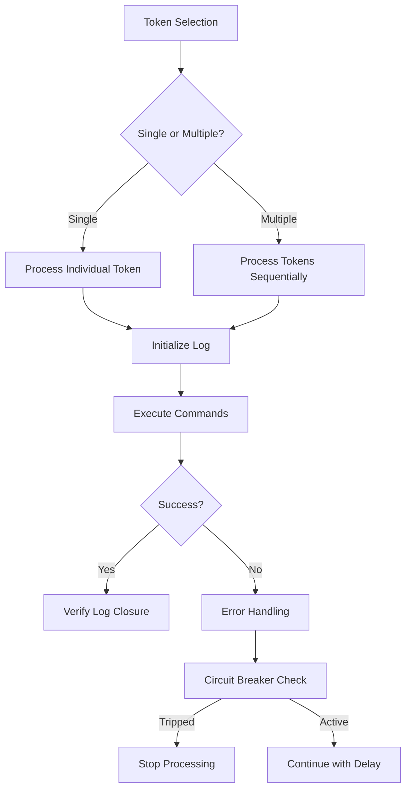

# Token Processing Documentation

## Sequential Execution Details

The Commander application processes tokens through a sequential execution pipeline that ensures proper ordering and resource management. This system handles both FBC (Field Bus Controller) and RPC (Remote Procedure Call) tokens with distinct processing paths while maintaining consistent error handling and logging.

### Processing Workflow

1. **Token Selection**:
   - Users select tokens via context menu in the Commander UI
   - Context menu dynamically filters actions based on token type (FBC/RPC) and selection count
   - Single-token selection shows type-specific actions (Process FBC, Print, Clear)
   - Multi-token selection shows batch processing options

2. **Sequential Processing**:
   - [`SequentialCommandProcessor._prepare_token_context()`](src/commander/services/sequential_command_processor.py:294) standardizes log headers with token metadata
   - Token processing occurs in strict sequence with circuit breaker protection
   - Each token's processing includes:
     * Log file initialization with standardized naming
     * Telnet client acquisition/reuse validation
     * Command execution with error handling
     * Log closure verification

3. **Execution Flow**:


## Log File Structure

### Naming Convention
Log files follow the standardized format:  
`{node_name}_{token_id}_{ip_address}_{timestamp}.{extension}`

Where:
- `node_name`: Alphanumeric identifier (e.g., AP01m, NODE1)
- `token_id`: 3-digit token identifier (e.g., 162, 2a2)
- `ip_address`: Node IP address with periods replaced by hyphens (e.g., 192-168-0-11)
- `timestamp`: Unix timestamp in milliseconds
- `extension`: `.fbc` for FBC logs, `.rpc` for RPC logs

### Example Filenames
- `AP01m_162_192-168-0-11_162.fbc`
- `NODE1_123_192.168.1.1_123.fbc`
- `unknown-node_unknown-ip_unknown-token.fbc` (for invalid tokens)

### Log Header Format
All logs begin with standardized metadata:
```
[LOG START] Token: {token_id} | Node: {node_name} | Type: {token_type} | Timestamp: {iso8601}
[PROCESSING] Started at {timestamp} | Circuit Breaker: {state}
```

## Troubleshooting Common Issues

### 1. Circuit Breaker Activation
**Symptoms**:  
- Processing stops after several tokens
- Error message: "Circuit breaker activated to prevent system overload"
- Log entries show repeated connection errors

**Resolution**:  
- Wait 5 minutes for automatic reset
- Verify network connectivity to target nodes
- Check if target nodes are overloaded
- Adjust circuit breaker thresholds in `src/commander/constants.py`:
  ```python
  CIRCUIT_BREAKER_MAX_FAILURES = 5  # Default: 3
  CIRCUIT_BREAKER_RESET_TIMEOUT = 300  # Seconds
  ```

### 2. Incomplete Log Files
**Symptoms**:  
- Log files missing `[LOG END]` marker
- Log size smaller than expected
- Subsequent processing fails with "log not closed" errors

**Resolution**:  
- Verify `open_log_for_token()` always calls `close_log()`
- Check for unhandled exceptions in processing pipeline
- Implement mandatory log closure verification:
  ```python
  def open_log_for_token(self, token):
      # ... setup ...
      try:
          yield log_writer
      finally:
          self._verify_log_closure(log_writer)
  ```

### 3. Telnet Client Reuse Failures
**Symptoms**:  
- "Telnet client in error state" errors
- Intermittent command failures
- Connection resets during batch processing

**Resolution**:  
- Validate client state before reuse:
  ```python
  if not error_handler.validate_telnet_client_reuse(client, token_context):
      client = self._create_new_client(token)
  ```
- Increase Telnet timeout values in configuration
- Implement client health checks between commands

### 4. Token Processing Timeouts
**Symptoms**:  
- "Processing token X... (stuck)" status messages
- No log output for extended periods
- Application becomes unresponsive

**Resolution**:  
- Adjust timeout values in `src/commander/constants.py`:
  ```python
  TELNET_COMMAND_TIMEOUT = 10.0  # Seconds
  TOKEN_PROCESSING_TIMEOUT = 30.0  # Seconds
  ```
- Verify network latency to target nodes
- Check for firewall restrictions on Telnet ports

## Best Practices

1. **Error Handling**:
   - All errors include token context metadata
   - Standardized error format: `[ERROR] Message | Token ID: X, Node: Y, Type: Z`
   - Circuit breaker provides token-specific context in messages

2. **Log Management**:
   - Always verify log closure in `finally` blocks
   - Use context managers for log handling
   - Implement log rotation for long-running processes

3. **Testing Coverage**:
   - Context menu service tests validate parameter passing
   - End-to-end tests verify full processing flow
   - UI feedback tests confirm status updates