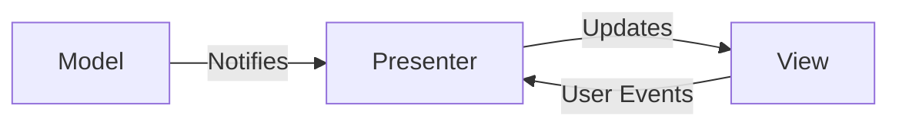

# Commander Module

## Overview
The Commander module is responsible for managing network commands and sessions in the LOGReporter application. It provides a user interface for interacting with network nodes and executing commands via Telnet, VNC, and FTP protocols.

## Component Responsibilities

### View Components (`src/commander/ui/`)

#### NodeTreeView
- Responsible for displaying the hierarchical node tree structure
- Handles user interactions with the tree view (selection, expansion, double-click)
- Provides signals for UI events (load nodes, set log root, node selection, etc.)
- Contains no business logic

#### CommanderWindow (UI Elements)
- Main window layout and widget organization
- Tab management for different session types (Telnet, VNC, FTP)
- Connection bar components for managing network connections
- UI event handling for buttons and input fields

### Presenter Components (`src/commander/presenters/`)

#### NodeTreePresenter
- Encapsulates UI logic for node tree management
- Handles lazy loading of node children
- Processes fieldbus and RPC commands
- Manages context menu interactions
- Coordinates between View and Model components
- Contains no direct UI code (no DOM manipulation)

#### CommanderPresenter
- Manages overall application state and UI logic
- Coordinates between different UI components
- Handles global UI events and state changes

### Model Components (`src/commander/`)

#### NodeManager
- Manages node data and configuration
- Handles loading and scanning of log files
- Maintains node status information

#### CommandQueue
- Manages queuing and execution of commands
- Handles command processing and results

#### SessionManager
- Manages network sessions (Telnet, VNC, FTP)
- Handles session creation, connection, and disconnection

#### LogWriter
- Handles writing to log files
- Manages log file operations

### Service Components (`src/commander/services/`)

#### FbcCommandService
- Handles FBC (Fieldbus Command) specific operations
- Processes fieldbus commands and token validation

#### RpcCommandService
- Handles RPC (Remote Procedure Call) specific operations
- Processes RPC commands and token validation

#### ContextMenuService
- Manages context menu interactions
- Handles context menu actions for nodes and tokens

#### ContextMenuFilterService
- Filters context menu options based on node/token state

## Interface Contracts

### View-Presenter Communication
- Views communicate with Presenters through PyQt signals
- Presenters update Views through method calls on view interfaces
- Clear separation: Views never directly call Model methods

### Presenter-Model Communication
- Presenters directly call Model methods to retrieve or update data
- Models notify Presenters of changes through callbacks or signals
- Services act as intermediaries for complex operations

### Component Dependencies
- Views depend only on Presenters (not Models or Services directly)
- Presenters depend on Views, Models, and Services
- Models and Services have no dependencies on Views or Presenters
- Services may depend on Models for data operations

## Testing Strategy

### Unit Testing
- Each component should be unit tested in isolation
- Mock dependencies for focused testing
- Test both successful and error scenarios

### Integration Testing
- Test View-Presenter interactions
- Test Presenter-Model interactions
- Test end-to-end command processing workflows

### UI Testing
- Test UI event handling
- Test state transitions and UI updates
- Test error handling and user feedback

## MVP Implementation Details

This module follows the MVP (Model-View-Presenter) pattern as defined in the project standards:

1. **Model**: Handles data state (`NodeManager`, `CommandQueue`, etc.)
2. **View**: Manages UI rendering (`NodeTreeView`, UI components in `CommanderWindow`) 
3. **Presenter**: Encapsulates UI logic (`NodeTreePresenter`, `CommanderPresenter`)

The implementation ensures:
- Views contain no business logic
- Presenters have no direct DOM or UI code
- Clear separation of concerns between components
- Testable and maintainable code structure

### Architecture
