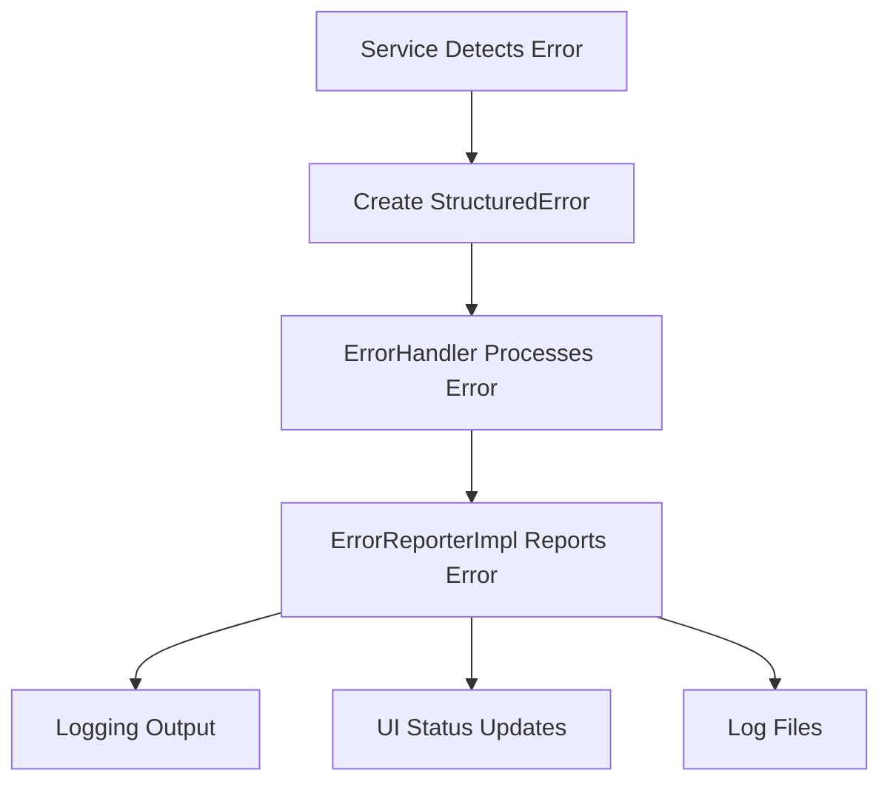

# Error Delegation Pattern

This document defines the delegation pattern for error handling in the Commander application.

## Overview

The error handling system is divided into three layers:
1. **Error Creation Layer** - Services that detect and create errors
2. **Error Reporting Layer** - Centralized error reporting implementation
3. **Output Formatting Layer** - Services that format output for specific contexts

## Delegation Flow

## Responsibilities

### ErrorHandler (Error Creation Layer)
- Detects specific error conditions
- Creates `StructuredError` objects with appropriate context
- Delegates to `ErrorReporter` for actual reporting
- Contains specialized methods for different error types:
  - `handle_connection_error()`
  - `handle_telnet_error()`
  - `handle_file_error()`
  - `handle_validation_error()`

### ErrorReporterImpl (Error Reporting Layer)
- Centralized error reporting implementation
- Handles logging to different outputs (console, files, UI)
- Manages error severity levels
- Emits Qt signals for UI updates
- Provides both structured and simple error reporting methods

### LoggingService (Output Formatting Layer)
- Handles command result logging
- Manages telnet command output logging
- Uses `ErrorReporter` for error reporting (delegates)
- Formats output for specific contexts (log files, UI messages)

## Implementation Details

### Error Creation
Services that detect errors should create `StructuredError` objects with:
- `code`: Unique error code
- `message`: Human-readable error message
- `context`: Additional context information (optional)
- `exception`: Exception object if applicable (optional)
- `severity`: Error severity level (ERROR, WARNING, INFO)
- `timestamp`: When the error occurred (optional)

### Error Reporting
All error reporting should go through `ErrorReporterImpl` which:
- Logs errors to the appropriate logging level
- Emits Qt signals for UI updates
- Handles exception tracebacks
- Manages message display durations

### Output Formatting
Services that need to format output for specific contexts:
- Handle formatting locally for non-error cases
- Delegate error reporting to `ErrorReporter`
- Can still use logging directly for non-error information